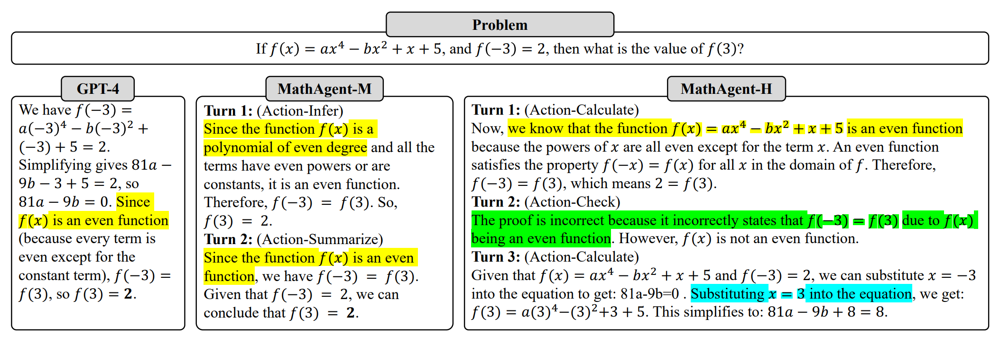

# Modeling Complex Mathematical Reasoning via Large Language Model based MathAgent
This repo is source code of article: [Modeling Complex Mathematical Reasoning via Large Language Model based MathAgent](http://article.will.be.available.soon.)

## Introduction
We propose a formal description of
the mathematical solving and extend LLMs with an agent-based zero-shot framework named Planner-Reasoner-Executor-Reflector (PRER). 
We further provideand implement two MathAgents that define the logical forms and inherent relations via a pool of actions in different grains and orientations: MathAgent-M adapts its actions to LLMs, while MathAgent-H aligns with humankind.
## Quick start
1. Change the value of OPENAI_API_KEY in file `.env` by your own key.
2. Run `test.ipynb`

## Test on MATH or miniF2F
1. Clone this repo and install dependency by
```bash 
pip install -r requiresments.txt
```
1. download miniF2F(informal) and MATH for future test
```bash
  cd data
  ```
   a. miniF2F:
   ```bash
   git clone https://github.com/facebookresearch/miniF2F.git
   ```
   b. MATH
   ```bash
   wget https://people.eecs.berkeley.edu/~hendrycks/MATH.tar
   tar -xvf MATH.tar
   ```
2. Before test, conform your directory structure is like:

```text
data
└--MATH
   └--test
   └--train
   ...
└--miniF2F
   └--informal
      └--test
      └--valid
   ...
src
main.py
readme.md
requiresments.txt
test.ipynb
```
3. Run MathAgent on these two dataset and store results.
```bash
python main.py \
--dataset "MATH"\
--split "test"\
--topic "algebra"
```


## Results
The following table shows the results of our tests on the MATH dataset. More detailed results and analysis will be found in papper.

|Method| Alg | Prob| Geo | InterAlg | NumTh | PreAlg | Precal | overall|
|---|---|---|---|---|---|---|---|---|
|WizardMath|33.3 |17.3 | 15.7| 7.1|16.3 | 41.7|12.6 | 22.7 |
|MAmmoTH | -| -| -|- |- |- |- | 46.8 |
|CR*(k=4)|79.3 | 57.9 | 39.0 | 28.9 | 54.8 | 71.8 | 30.4 | 54.20 |
GPT4+CCoT(k=8) |70.8|53.1|36.5|23.4|49.6|71.6|26.7|50.36|
|GPT4+PHP(k=8) |<u>74.3</u>|<u>56.3</u>|41.9|26.3|<u>55.7</u>|73.8|29.8|<u>53.90</u>|
|GPT4| 66.3|53.5|41.5|23.7|43.0|<u>74.5</u>|29.7 |49.76|
|MathAgent-M(ours)  |64.3|54.6|<u>44.1</u>|<u>27.2</u>|45.4|74.4|<u>31.5</u>|50.88 |
|| <font color=#D83931>-2.0</font> | <font color=#2EA121>+1.9</font> | <font color=#2EA121>+2.6</font> | <font color=#2EA121>+3.5</font> | <font color=#2EA121>+2.4</font> | <font color=#D83931>-0.1</font> | <font color=#2EA121>+1.8</font> | <font color=#2EA121>+1.12</font>|
|Math Agent-H(ours) | **76.0** |**62.0**|**47.6**|**31.0**|**59.1**|**83.5**|**36.8**|**59.02**| 
|| <font color=#2EA121>+9.7</font> | <font color=#2EA121>+8.5</font> | <font color=#2EA121>+6.1</font>|<font color=#2EA121>+7.3</font>|<font color=#2EA121>+16.1</font>|<font color=#2EA121>+9.0</font>|<font color=#2EA121>+7.1</font>|<font color=#2EA121>+9.26</font>|
## Citation
If you find this useful in your research, please cite as:
```text
@article{PRER2023,
  title={Modeling Complex Mathematical Reasoning via Large Language Model based MathAgent},
  author={Haoran Liao and Qinyi Du and Shaohua Hu and Hao HE and Yanyan Xu and Jidong Tian and Yaohui Jin},
  journal={Arxiv},
  year={2023}
}
```
